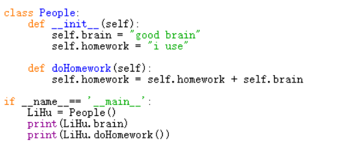
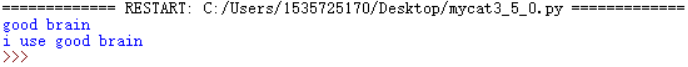
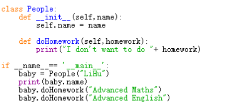
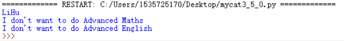

#Python_3.5.0 面向对象实现虚拟宠物猫

1.导入依赖包 
 import threading 
 import time 
 import random 
 import string 

2.如何定义类 
#####类是一个抽象概念，你可以定义它拥有什么和能做什么 
比如人拥有智慧，可以做题。 
—— 一个类拥有的东西，被称为这个类的成员变量。（在后面的编程中你会发现，这就是一个类的内部global，好处是不需要声明很多global变量了，那样太难管理了） 
—— 一个类能做什么，被称为这个类的函数。 
如何简单地定义一个类，在这举个例子。 
 
1）首先要声明类的名称：class People： 
2）声明类中的函数，规则为：第一个参数必须是self！！！这是由于此时还没有具体化，要说明它的成员是它自己的，成员变量都必须以self.xxx来定义和在声明这个类时使用。 
比如例中self.brain是为了说明：这个类被具体化之后拥有一个脑子 
比如在doHomework函数中需要使用自己的脑子，所以写的是self.brain，强调自己的脑子 
3）每个类必须有一个名为__init__的函数，当你把它具体化为一个或多个实例的时候，用来初始化成员变量的值。比如例中我设定人都有一颗好脑子 
4）具体化（专业：实例化）一个类，例中LiHu= People()，这里的People由于上一条声明时，没有self以外的参数，所以不需要有参数（待会讲有参数的情况） 
5）说明：这里的if __name__== '__main__':当作main()函数来用就好了，程序从这里开始运行，不需要太深入理解 
6）现在可以为所欲为地使用已经被具体化的类了，就如图中所示一样，print只是用来检验结果的，以下是输出结果 
 

3.进一步使用类 
1）往类里加参数，有助于初始化这个类 
2）往类函数里加参数，有助于这个类与外界接触 
这次还是举People的例子，只不过是他刚从程序里出生，我需要给他取名字，还需要给他布置作业，我写了以下代码
 
这样，我真正用People这个类生出一个小孩时，他的名字是我这个外界的物质给的（baby = People("LiHu")），因为他__init__函数初始化时使用的是外界传入的参数name 
其次，他的作业也是我这个外界的物质布置的 baby.doHomework("Advanced Maths")
以下是输出结果
 
##这样，类的定义和使用就讲解完了，之后就是怎么使用一些工具了，这些都是我网上现查现用的

4.初步定义TommyCat类 
由于时间原因，先做了个简单类的初步定义和实现,注释在代码旁边了，你先语义上了解我的逻辑 
